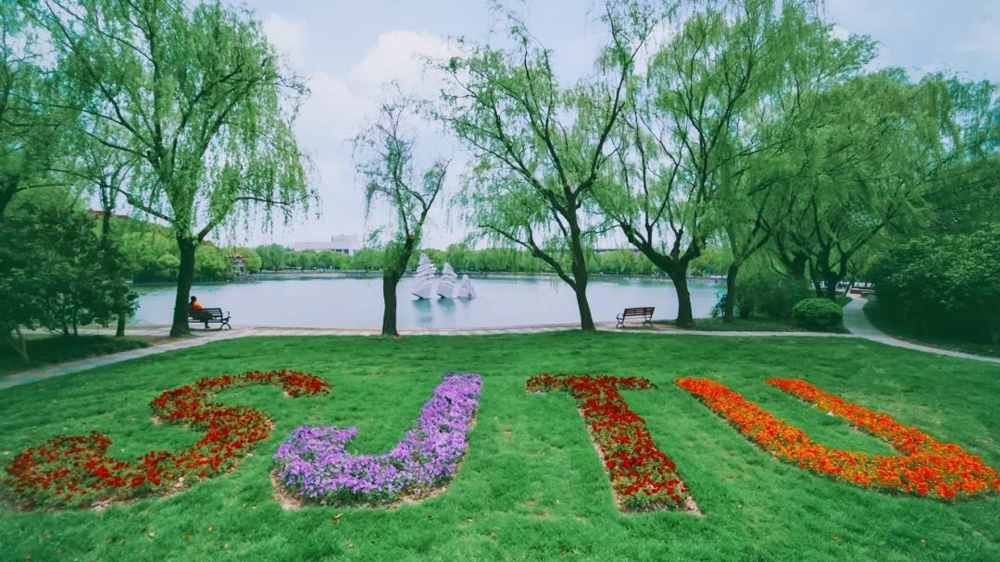

# ICE2607 Lab1: Image Feature Extraction

This project facilitates drawing color, gray, and gradient histograms for images effortlessly. Additionally, it offers an extra edge detection method.

## File structure

- `codes/`
    - `hist.py`: Contains Histogram classes.
    - `main.py`: Main Python script.
- `images/`: Contains default test images.
- `hists_example/`: Contains output histograms of default tests.
- `test_images/`: Contains more test images.
- `Lab1_report.pdf`
- `README.md`
- `Makefile`
- `requirements.txt`

## Example

<style>
    .figure-container {
        display: flex;
        justify-content: center;
        align-items: center;
    }
    figure {
        text-align: center;
    }
    .image-container {
        display: flex;
        justify-content: center;
        align-items: center;
        height: 200px;
    }
    .image-container figure {
        margin: 5px;
        text-align: center;
    }
    .image-container figcaption {
        margin-top: 10px;
    }
</style>

<div class="figure-container">
    <figure>
        
        <figcaption>Sample Image (SJTU)</figcaption>
    </figure>
</div>

Below are the output figures of the color, gray, and gradient histograms of the sample image.

<div class="image-container">
    <figure>
        
        <figcaption>Color Histogram</figcaption>
    </figure>
    <figure>
        
        <figcaption>Gray Histogram</figcaption>
    </figure>
    <figure>
        
        <figcaption>Gradient Histogram</figcaption>
    </figure>
</div>

## Install

1. Ensure that you have Python installed on your system.

2. Clone or download this project and navigate to the project directory.

3. Check if the dependencies listed in `requirements.txt` are installed. If not, create a virtual environment (if necessary) and run `make install`.

## Usage

### Test default images
```
python -m codes.main
```

This command will utilize the three images in the `./images` directory as input and save all histograms to the `./hists` directory.

### Test personalized images
```
python -m codes.main \
    --hist-type all \
    --input-dir path/to/input/folder \
    --output-dir path/to/output/folder \
    --output-type png
```

Note: 
- The  `hist-type`· can be selected from 'color', 'gray', 'gradient', and 'all' (for all three histograms). 
- Avoid duplicate filenames in `input-dir`.
- The `output-type` parameter is optional.

### Edge Detection
```
from codes.hist import GradientHist

grad_hist = GradientHist("path/to/your/image.jpg")
grad_hist.save_grad_img("path/to/output/folder", "filename.png")
```